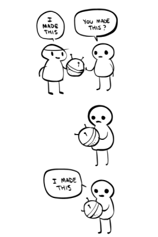

# BruteForce's
This is program for testing brute force password cracking (just a programming project in my free time), No need to install libraries, just download and run!

## How this work?
enter password, and this system will trying to crack it and will you how long it taken, to ctack you password enter before

this programe running with muti thread (Default: 8)

Container with a common password list it will scan before (if you agree to), but if it didn't found on file or you disagree it will auto generate password all possible letter

# LICENSE
this project protect by [MIT License](LICENSE)

